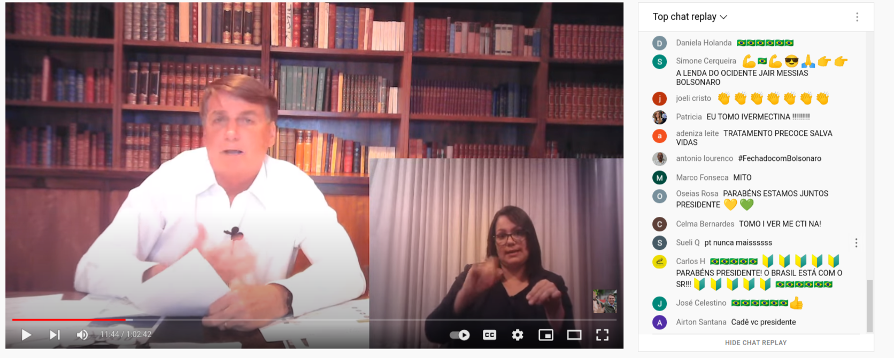
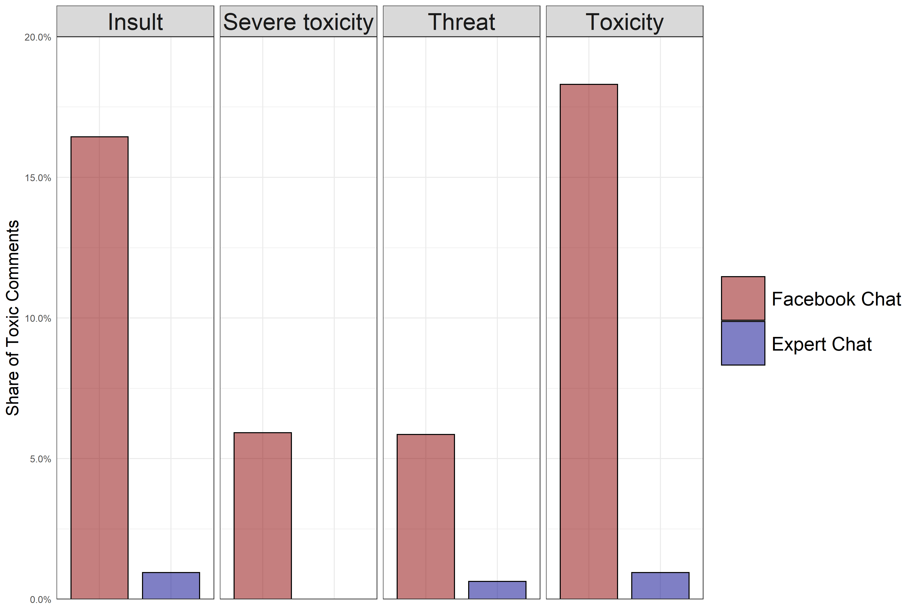
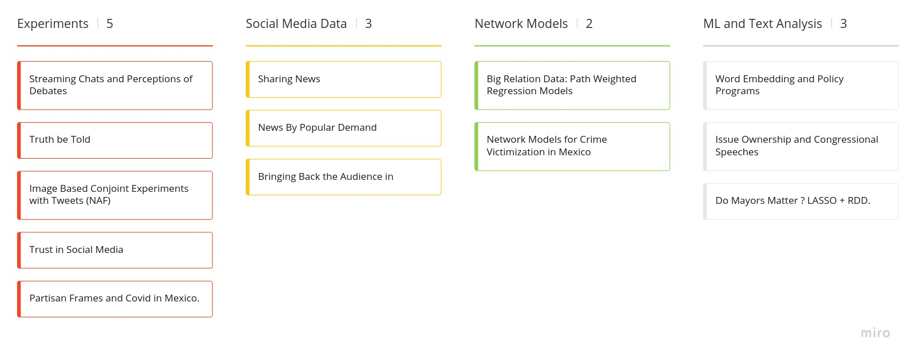

```{r setup, include=FALSE}
options(htmltools.dir.version = FALSE)
knitr::opts_chunk$set(messagwese=FALSE, warning = FALSE)
xaringanthemer::style_mono_accent(base_color ="#23395b", 
                                  title_slide_text_color="#23395b", 
                                  title_slide_background_color = "#fbf9f4", 
                                  background_color = "#fbf9f4", 
                                  link_color =  "#F21A00", 
                                  code_font_size = "60%")

options(htmltools.dir.version = FALSE)
knitr::opts_chunk$set(message=FALSE, warning = FALSE, error=TRUE, cache=TRUE)
``` 
class: inverse

.pull-left[

<br><br><br>
## About me ...

Researcher on Civic Integrity on @Twitter.

Ph.D Candidate Government and Politics at University of Maryland.

Affiliated with the Interdisciplinary Lab for Computational Social Science at UMD.

]

--

.pull-right[
<br>
<br>


### Find me at...
[`r icons::simple_icons("twitter")` @TiagoVentura_](https://twitter.com/_Tiagoventura)

[`r icons::simple_icons("github")` TiagoVentura](https://github.com/TiagoVentura)

[`r icons::ionicons("mail")` venturat@umd.edu](venturat@umd.edu)

[`r icons::ionicons("link-outline")` https://tiagoventura.rbind.io/](https://tiagoventura.rbind.io/)
]

--

---

## Plans for Talk

--

- **The Effect of Streaming Chats on Perceptions of Debates.** Forthcoming at the Journal of Communication .footnote[Thanks to my co-authors: Kevin Munger, Katherine McCabe, Victory Asbury and Keng-Chi. And to Russell Sage Foundation and the Summer Institute in Computational Social Science for providing funding and institutional support to the projects.] 


<!-- - **Bringing the Audience Back In: Connective Effervescence and Streaming Chat During Political Debates.** Journal of Quantitative Description: Digital Media, 2020 -->

--

- **What I Wish I Knew**: A bit of my experience as a researcher at @Twitter. 


---
class:middle, center, inverse

## Streaming Chats and Politics.

---

## Recent Changes on Media Market. 

--

- New media technologies <~~> Media Consumption and Broadcasting becoming more social.  

--

- Users move from passive consumers to an active co-creators of the media experience. 

--

- On the user side: emergence of social media app brings the user to the center of media production. 

--

- On the supply side: Media producers started to integrate their products with a strong audience participation. 

    - Dual Screening: Encouraging audiences to engage with their content via social media.

--

---
class: center, middle

### **Streaming Chats** are the most recent and powerful manifestation of these user-centered technologies.

---
## Streaming Chats

--

**Video Feed + Social Chat: All in one screen.**

--

Already widely adopted by mainstream media broadcasting: news TV shows, sports programs, and political debates.

--

Popular among the younger generations.

- Twitch (Amazon)
- YouTube/YouTube Gaming (Google)
- Mixer (Microsoft)
- Facebook Lives

--

---
## Political Debates


---
class: middle, center

### AOC

```{r echo=FALSE, out.width="50%"}
knitr::include_graphics("./figs/aoc.png")
```

### Jair Bolsonaro

```{r echo=FALSE, out.width="50%"}

```

---
class: center, inverse

### Are we paying enough attention to these technologies?

<br><br>

```{r echo=FALSE, out.width = "60%"}
knitr::include_graphics("./figs/gu.png")

```
 
---
class: center, middle


### What are the effects of <a style="color:red"> streaming chats </a> on the public viewing experiences? 

---

### The Effect of Streaming Chat on Perceptions of Political Debates

We conducted a large scale ''field" experiment that assigns would-be debate viewers to watch on different platforms the October 2019 Democratic Debate.

--
<br>
<br>

**Three main experimental conditions**

- Control (standard NBC broadcast)
- Expert chat (538 website)
- Streaming chat (Facebook)

--
<br>
<br>

We then surveyed the respondents after the debate and measured the effects of streaming chats. 

--

---

## How are streaming chats different from Dual Screening ?
  
<br><br>
**Different audience**. 6 out 10 young americans prefer to use online streaming to watch TV (Pew,  2017). 
  
**Different Technology**: Chat streams at eye-level; only one, quick, and fast conversation. 

**More cross-cutting information**: particularly on political debates
---
class: middle


- **Shift from polite (possibly partisan) broadcasters towards an experience similar to comments sections**: short comments, memes, others 

- **Chaotic Discussion**:Hard to sort, only see comments in the aggregate,   prone to lead to majority illusion.

- **Priming a very different set of issues**: most of them do not appear on the public discussions. 


--

---
## How do streaming chats influence perceptions of political events?

<br>

- **Frequency**: high volume of very short comments.

- **Toxicity**: almost anonymity and size of the comments are prone to high levels of toxicity. 

- **Content**: topics are mostly distinct from the ones discussed publicly during campaigns. 

- **Context**: comments' composition leads to inaccurate inferences of overall public.


---
class:inverse, middle, center

## Research Design

---
## Research Design and Sample

Two-Wave On-line Survey in September 2019 through MTurk (following Gross, Porter and Wood, 2019). 

**Wave 1 pre-debate survey with 2352 respondents**

- Identified respondents likely to watch debate, have Facebook account, could watch debate on a computer.

Encouraged 1095 eligible and interested participants to watch debate on randomly assigned platform.
    
**Wave 2 survey with 908 respondents**

- Analysis focuses on 576 Wave 2 Democratic respondents (including leaners) who watched at least part of the debate.

- N= 204 (Control), N= 174 (Expert), N= 198 (Social)

---

### Treatment Arms


.pull-left[]
.pull-right[]

.center[

```{r echo=FALSE, out.width = "60%"}
include_graphics("./fgv_pres/screenshot-abc.png")
```

]

---
## Text Analysis

To complement our analysis, we scrapped the comments on the two platforms. 

- 300 Comments on Expert + 6915 on Facebook. 

- Performed Dictionary Methods Sentiment Analysis. 

- Labeled the comments manually to identify topics. 

- Deep Learning Models to identify toxicity. 

---

## Hypotheses

<br><br>
```{r echo=FALSE}

d <- read.csv("hyp.csv")

library(kableExtra)

d %>%
 kable(., "html", booktabs = T,align = c('c','l','l')) %>%
  kable_styling(latex_options = c("striped",
                                  "scale_down","repeat_header"),
                font_size = 14,
                # font_size = 12,
                full_width = T) %>% 
  column_spec(1, bold=T, width = '1in') %>% 
  column_spec(2,width = '3in') %>% 
  column_spec(3,width = '3in') 

```

---
class:inverse, middle, center

## Text Analysis: Validating Theoretical Premises

---
### High Frequency


.center[
```{r  echo=FALSE, out.width= '80%'}
knitr::include_graphics("./fgv_pres/freq-bind.png")
```
]
---
### Much more toxic:

.center[
```{r  echo=FALSE, out.width= '80%'}

```
].footnote[Deep Learning Models from Google Perspective API]

---
### Contains Mostly Negative Primes

.center[
```{r  echo=FALSE, out.width= '80%'}
knitr::include_graphics("./fgv_pres/topics_3by_cand.png")
```
]

---
#### Mostly Negative Polarity about the Candidates

.center[
```{r  echo=FALSE, out.width= '80%'}
knitr::include_graphics("./fgv_pres/polarity_candidates.png")
```
]

---
class:inverse, middle, center

## Experimental Results

---
## Frequency and Toxicity Hypotheses
.center[
Facebook chat somewhat less informative, enjoyable, and engaging
```{r  echo=FALSE, out.width= '80%'}
knitr::include_graphics("./fgv_pres/frequencyplot.png")
```
]

---
## Feeling Thermomethers about the Candidates

```{r  echo=FALSE, out.width= '80%'}
knitr::include_graphics("./fgv_pres/ftplot.png")
```

---
## Content Effect
.center[
```{r  echo=FALSE, out.width= '80%'}
knitr::include_graphics("./fgv_pres/ft_on_negative_comments.png")
```
]


---
## Poll Performance

```{r  echo=FALSE, out.width= '80%'}
knitr::include_graphics("./fgv_pres/pollplot.png")
```

---
## Context Effect
.center[
```{r  echo=FALSE, out.width= '80%'}
knitr::include_graphics("./fgv_pres/polls_on_positive_comments.png")
```
]

---
## Summary

.pull-left[
**Main Findings**:

- Creates worse viewing experience.

- May disproportionately negatively affect certain candidates subject to toxic, negative comments.

- May distort inferences about candidate viability.

]

.pull-right[
**Next Steps**:

- More research on the mechanism (laboraty experiments).

- More comparative evidence (Does it replicate to other plataforms or other countries?). 

- More descriptive evidence about these news technologies.

]

---
class: inverse, middle, center

### As these new technologies start to dominate broadcasting of political events, attracting particularly <a style:"color=red"> younger audiences </a>, we need more social science <a style:"color=red"> descriptive and causal research </a> about the effects on users' behavior. 

---

class:inverse, middle, center


#### Bringing the Audience Back In: Connective Effervescence and Streaming Chat During Political Debates. *Journal of Quantitative Description: Digital Media, 2021*

---


class: middle, center

### `r icons::simple_icons("twitter")` About being a Researcher in the Industry `r icons::simple_icons("twitter")`


---
class:middle

### Learn your methods... But you will be hired by the interesting questions your research answers. 

--

```{r echo=FALSE, out.width="100%"}
knitr::include_graphics("figs/my_research.jpg")
```

--


---
class: middle

### Be Versatile. Learn how to learn new things. Show you can play on multiple fields.  

--

```{r echo=FALSE, out.width="100%"}

```

--

---
class:middle

### Take seriously the policy implications of your research now. That is pretty much what the industry is looking for. 


---
class:middle

### Take time to learn SQL. Simple, and almost as important as any other language. 

---
class:inverse, middle, center

# Thank you! 

