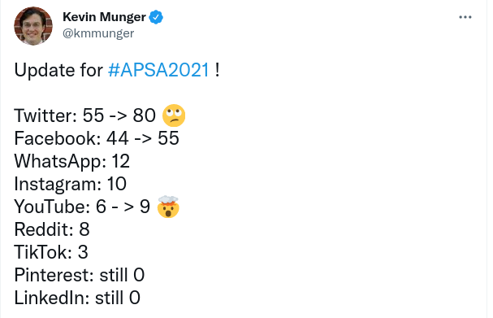
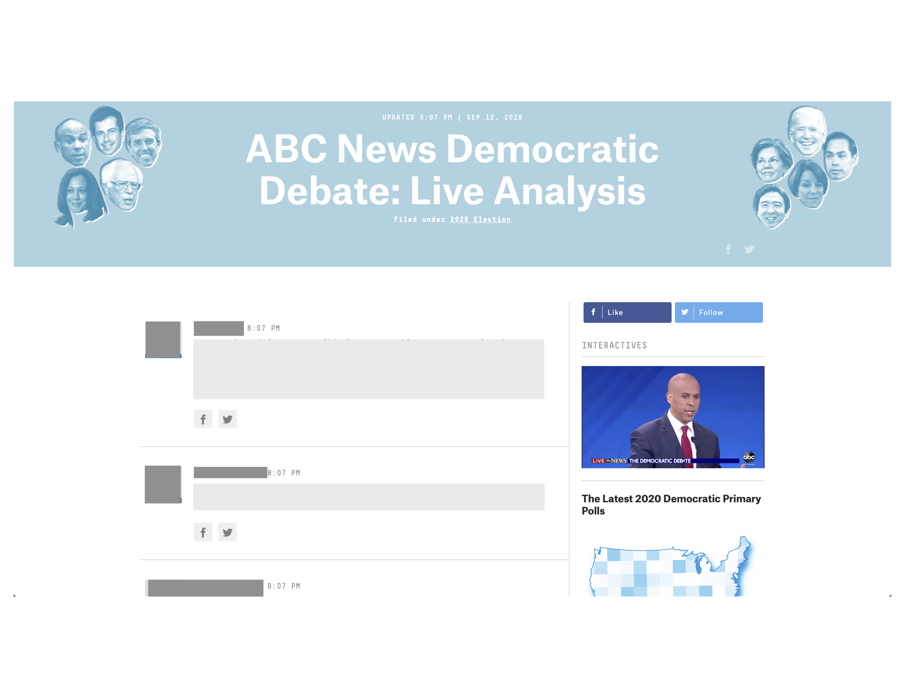
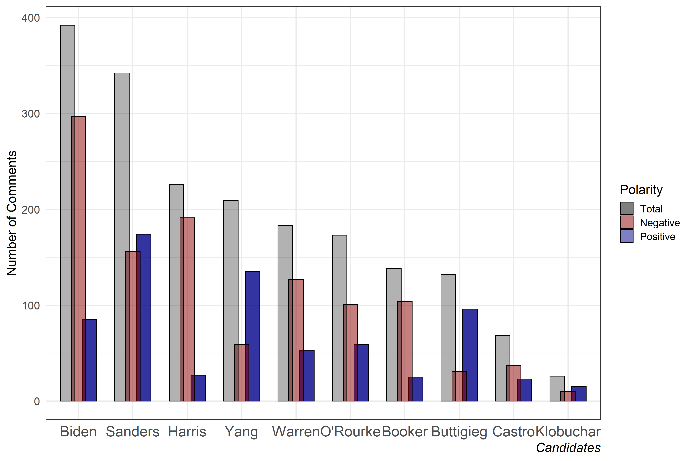
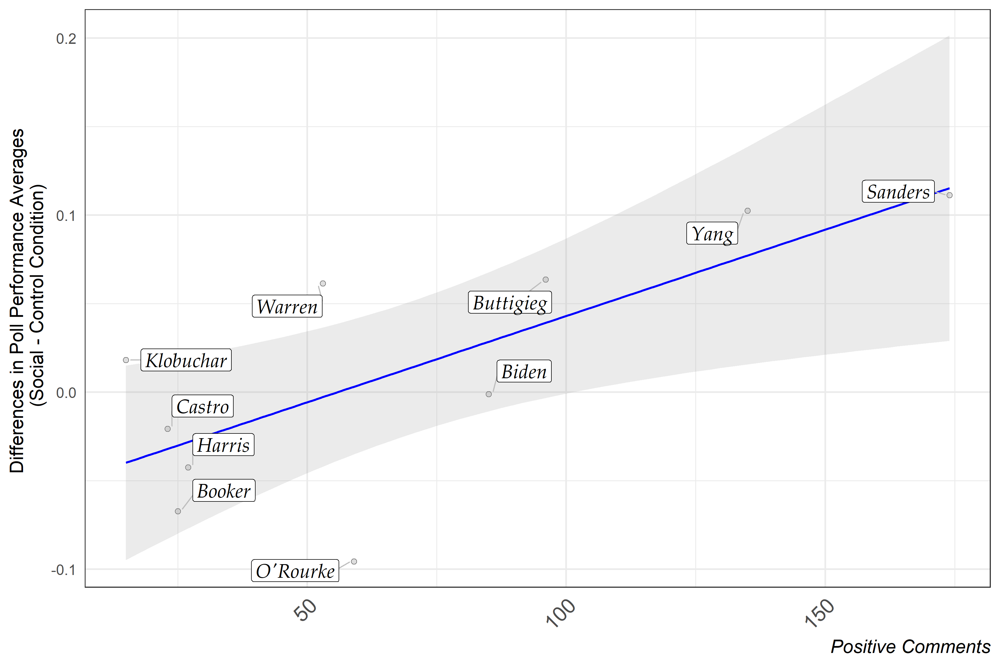
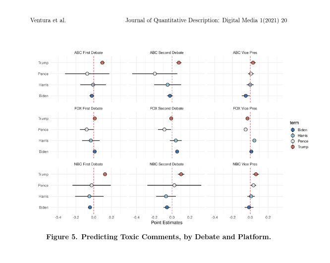
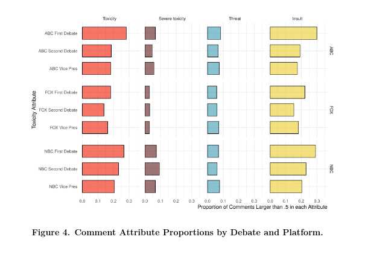

```{r setup, include=FALSE}
options(htmltools.dir.version = FALSE)
knitr::opts_chunk$set(messagwese=FALSE, warning = FALSE)
xaringanthemer::style_mono_accent(base_color ="#23395b", 
                                  title_slide_text_color="#23395b", 
                                  title_slide_background_color = "#fbf9f4", 
                                  background_color = "#fbf9f4", 
                                  link_color =  "#F21A00", 
                                  code_font_size = "60%")

options(htmltools.dir.version = FALSE)
knitr::opts_chunk$set(message=FALSE, warning = FALSE, error=TRUE, cache=TRUE)
``` 
class: inverse

.pull-left[

<br><br><br>
## About me ...

Researcher on Civic Integrity on @Twitter.

Ph.D Candidate Government and Politics at University of Maryland.

Affiliated with the Interdisciplinary Lab on Computational Social Science at UMD.

]

--

.pull-right[
<br>
<br>


### Find me at...
[`r icons::simple_icons("twitter")` @TiagoVentura_](https://twitter.com/_Tiagoventura)

[`r icons::simple_icons("github")` TiagoVentura](https://github.com/TiagoVentura)

[`r icons::ionicons("mail")` venturat@umd.edu](venturat@umd.edu)

[`r icons::ionicons("link-outline")` https://tiagoventura.rbind.io/](https://tiagoventura.rbind.io/)
]

--


## Plans for Talk

--

- **The Effect of Streaming Chats on Perceptions of Debates.** Forthcoming at the Journal of Communication .footnote[Thanks to co-authors: Kevin Munger, Katherine McCabe, Victory Asbury and Keng-Chi on Streaming Chats. And to Russel Sage Foundation and the Summer Institute in Computational Social Science for providing funding and institutional support to the projects.] 


- **Bringing the Audience Back In: Connective Effervescence and Streaming Chat During Political Debates.** Journal of Quantitative Description: Digital Media. 

--

- **What I Wish I Knew**: A bit of my experience as a researcher at @Twitter: 


---
class:middle, center, inverse

## Streaming Chats and Politcs.

---

class: middle, center

### United States: AOC

```{r echo=FALSE, out.width="50%"}
knitr::include_graphics("./figs/aoc.png")
```

### Brazil: Jair Bolsonaro

```{r echo=FALSE, out.width="50%"}
knitr::include_graphics("./figs/bolso.png")
```

---
## Streaming Chats

--

- **Video Feed + Comments: All in one screen.**

--

- Most of times: really fast and chaotic conversations.

--

- Popular among the young 

    - Twitch (Amazon)
    - YouTube/YouTube Gaming (Google)
    - Mixer (Microsoft)
    
---
## From Passive Consumer to Co-Creator.

These trends converge to broader transformations in the media market:

- Media consumption becoming more social. 

- Media producers encouraging audiences to engage with their content via social media.

- Dual Screening as the modal media consumption.

- Comments sections everywhere. 

--

---
class: center, inverse

### Are we paying enough attention to these new trends?

<br><br>

```{r echo=FALSE, out.width = "60%"}


```
 
---
class: center, middle


### What are the effects of <a style="color:red">live broadcast with streaming chats </a> on the public viewing experiences? 

---

### The Effect of Streaming Chat on Perceptions of Political Debates

We conducted a large scale ''field" experiment that assigns would-be debate viewers to watch the October 2019 Democratic Debate

--
<br><br>
**Three main experimental conditions**

- Control (standard NBC broadcast)
- Expert chat (538 website)
- Streaming chat (Facebook)

--
<br>
<br>

We then surveyed the respondents before and after, and measured the effects of streaming chats. 

--

---

### Related Literature: Dual Screening

At least a decade of research in Political Communication:  Users engage **real-time conversations** on a second screen (Twitter). 

- Initial concern about "distraction" supplanted by thinking about purposiveness (Gottfried et al., 2017; Van Cauwenberge et al., 2015, 2014)

- Viewers decide how to allocate their attention  (McGregor and Mourão, 201)7

- Changes the emphasis on what is observed: **priming**  (Barnidge et al., 2017)


**Main Conclusion**: Dual Screening generates more online political engagement (Barnidge et al., 2017; Gil de Zúñiga et al., 2015; McGregor and Mourão, 2017; Vaccari et al., 2015)


---

## New Features of Streaming Chats
  

**Different audience, different technology:**
  
  - Who is watching the Facebook livestream of a debate? 
  
  - Chat streams at eye-level; only one conversation (no personalization/viewer discretion)

- Thousands of comments, difficult to follow, and one only observes nodes of the network (majority illusion). 

---
class: middle

**More cross-cutting information and shift from genteel (possibly partisan) broadcasters towards the garbage fire that is comment sections**

- No moderation in real-time 

- Lots of repetition - "memes"  

- Hard to self-select (decide who to follow) 


---
class: middle

**Priming a very different set of issues**

- Many are outside the scope of standard politics 

- Maybe good (elite primes downplay serious attacks on candidate weakness)

- Maybe bad (reinforcing anti-deliberative, discriminatory and even hateful primes)
  
---
## Theorethical Pathways

We use the “Mix of Attributes” approach (Eveland, 2003) for describing new media technology and theorizing about its effects:

We theorize streaming chats are particularly distinct in four aspects:


- **Frequency**: high volume of very short comments.

- **Content**: topics discussed serve as primes.

- **Context**: comments' composition leads to inaccurate inferences of overall public.

- **Toxicity**: almost anonymity and size of the comments are prone to high levels of toxicity. 

---
class:inverse, middle, center

## Research Design

---
## Research Design and Sample

Two-Wave On-line Survey in September 2019 through MTurk (following Gross, Porter and Wood, 2019). 

**Wave 1 pre-debate survey with 2352 respondents**

- Identified respondents likely to watch debate, have Facebook account, could watch debate on a computer.

**Encouraged 1095 eligible and interested participants to watch debate on randomly assigned platform.**
    
**Wave 2 survey with 908 respondents**

- Analysis focuses on 576 Wave 2 Democratic respondents (including leaners) who watched at least part of the debate.

- N= 204 (Control), N= 174 (Expert), N= 198 (Social)

---

### Treatment Arms


.pull-left[]
.pull-right[]

.center[

```{r echo=FALSE, out.width = "60%"}
include_graphics("./fgv_pres/screenshot-abc.png")
```

]

---
## Text Analysis

To complement our analysis, we scrapped the comments on the three plataforms. 

- 300 Comments on Expert + 6915 on Facebook. 

- Perform Dictionary Methods Sentiment Analysis. 

- Labelled the comments manually to identify topics. 

- Deep Learning Models to identify toxicity. 

---

## Hypotheses

<br><br>
```{r echo=FALSE}

d <- read.csv("hyp.csv")

library(kableExtra)

d %>%
 kable(., "html", booktabs = T,align = c('c','l','l')) %>%
  kable_styling(latex_options = c("striped",
                                  "scale_down","repeat_header"),
                font_size = 14,
                # font_size = 12,
                full_width = T) %>% 
  column_spec(1, bold=T, width = '1in') %>% 
  column_spec(2,width = '3in') %>% 
  column_spec(3,width = '3in') 

```

---
class:inverse, middle, center

## Text Analysis: Validating Theoretical Premises

---
### High Frequency


.center[
```{r  echo=FALSE, out.width= '80%'}
knitr::include_graphics("./fgv_pres/freq-bind.png")
```
]
---
### Much more toxic:

.center[
```{r  echo=FALSE, out.width= '80%'}
knitr::include_graphics("./fgv_pres/proportion_toxicity.png")
```
].footnote[Deep Learning Models from Google Perspective API]

---
### Contains Mostly Negative Primes

.center[
```{r  echo=FALSE, out.width= '80%'}
knitr::include_graphics("./fgv_pres/topics_3by_cand.png")
```
]

---
#### Mostly Negative Polarity about the Candidates

.center[
```{r  echo=FALSE, out.width= '80%'}

```
]

---
class:inverse, middle, center

## Experimental Results

---
## Frequency and Toxicity Hypothesis Key Results

.center[
Social chat somewhat less informative, enjoyable, and engaging
```{r  echo=FALSE, out.width= '80%'}
knitr::include_graphics("./fgv_pres/ftplot.png")
```
]

---
## Feeling Thermomethers about the Candidates

```{r  echo=FALSE, out.width= '80%'}
knitr::include_graphics("./fgv_pres/ftplot.png")
```

---
## Content Effect
.center[
Social chat somewhat less informative, enjoyable, and engaging
```{r  echo=FALSE, out.width= '80%'}
knitr::include_graphics("./fgv_pres/ft_on_negative_comments.png")
```
]


---
## Poll Performance

```{r  echo=FALSE, out.width= '80%'}
knitr::include_graphics("./fgv_pres/pollplot.png")
```

---
## Context Effect
.center[
Positive social chat associated with projected poll performance.
```{r  echo=FALSE, out.width= '80%'}

```
]


---
## Summary

.pull-left[
**Main Findings**:

- Includes more frequent and more negative comments than expert chat.

- Creates worse viewing experience.

- May disproportionately negatively affect certain candidates subject to toxic, negative comments.

- May distort inferences about candidate viability.

]

.pull-right[
**Next Steps**:

- More research on the mechanism

- More Comparative Evidence. 


- More descriptive evidence about these news technologies.

]

---
class:inverse, middle, center


## Well.. we actually do have a second purely descriptive piece about the composition of comments on facebook streaming chats. 

--

**Bringing the Audience Back In: Connective Effervescence and Streaming Chat During Political Debates.** Journal of Quantitative Description: Digital Media. 

--

---

## Brief Summary:

We scrapped the chatboxes of livestreamed Presidential debates on the ABC News, NBC News, and Fox News Face-book pages. 

Collected more than one hundread thousand comments. 

Use deep-learning toxicity models to detect the amount of hateful sppech in each of the debates. 

---
## The Machine Working:


---
## Levels of Toxicity

Close to 20% of comments are classified as toxic or insult. 

```{r  echo=FALSE, out.width= '80%'}

```
---
## Strong Partisan Dynamics. 

```{r  echo=FALSE, out.width= '80%'}

```

---
class: inverse, middle, center

### As these new technologies start to dominate broadcasting of political events, attracting particularly <a style:"color=red"> younger audiences </a>, we need more social science <a style:"color=red"> descriptive and causal research </a> about the effects on users' behavior. 

---
class: middle, center

### `r icons::simple_icons("twitter")` About being a Researcher in the Industry `r icons::simple_icons("twitter")`


---
class:middle

### Learn your methods... But it is likely that you will be hired by the interesting questions your research answers. 

--

```{r echo=FALSE, out.width="100%"}
knitr::include_graphics("figs/my_research.jpg")
```

--


---
class: middle

### Be Versatile. Learn how to learn new things. Show you can play on multiple fields.  

--

```{r echo=FALSE, out.width="100%"}
knitr::include_graphics("figs/methods.jpg")
```

--

---
class:middle

### Take seriously the policy implications of your research now. That is pretty much what the industry is looking for. 


---

### Take time to learn SQL. Simple, and almost as important as any other language. 

---
class:inverse, middle, center

# Thank you!

