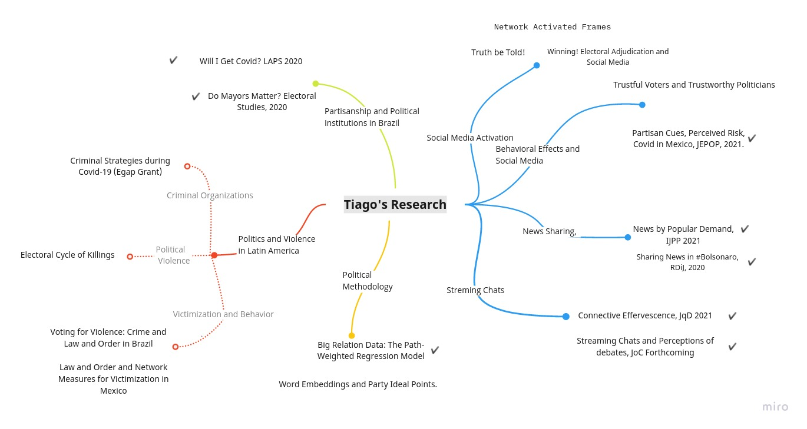

```{r setup, include=FALSE}
options(htmltools.dir.version = FALSE)
knitr::opts_chunk$set(messagwese=FALSE, warning = FALSE)
xaringanthemer::style_mono_accent(base_color ="#23395b", 
                                  title_slide_text_color="#23395b", 
                                  title_slide_background_color = "#fbf9f4", 
                                  background_color = "#fbf9f4", 
                                  link_color =  "#F21A00", 
                                  code_font_size = "60%")

options(htmltools.dir.version = FALSE)
knitr::opts_chunk$set(message=FALSE, warning = FALSE, error=TRUE, cache=TRUE)

install.packages("icon")
``` 
class: inverse

.pull-left[
<br>
<br>


### Encontre me em...
[`r icons::simple_icons("twitter")` @TiagoVentura_](https://twitter.com/_Tiagoventura)

[`r icons::simple_icons("github")` TiagoVentura](https://github.com/TiagoVentura)

[`r icons::ionicons("mail")` venturat@umd.edu](venturat@umd.edu)

[`r icons::ionicons("link-outline")` https://tiagoventura.rbind.io/](https://tiagoventura.rbind.io/)

]

--
.pull-right[

<br><br><br>

### Quem sou eu


Pesquisador em Integridade Civil e Política no @Twitter. 

Estudante de Doutorado em Governo e Política na Universidade de Marylad. 

Affiliado ao Laboratório Interdisciplinar de Ciência Social Computacional na UMD.
]
--

---
## Um tour na minha agenda de pesquisa



---

## Análise de Texto: Três métodos. 

Há três métodos principais para realizar análise de texto computacional. 

- Escalonamento -> Alinhar textos em uma determinada dimensão -> Redução de Dimensionalidade. 

- Classificação -> Este texto é sobre política? -> Aprendizado de Máquina. 

- Identificação de Tópicos -> Quais os principais temas deste texto? -> Modelos de Tópicos. 


---
## Como implementar ?


- Modelos Estatísticos, Métodos de redução de dimensionalidade, Aprendizado de máquinas, inteligências artificial, análise de redes....

- Tudo pode ser implementado em linguaguens gerais de programação: R ou Python. 

- Cientistas de Dados e Cientistas Sociais conseguem implementar estes métodos. 

- Nenhum destes métodos é superior a ler todos os documentos. As vantagens residem em velocidade e  volume de dados. 

---
## Modelos de Tópicos em Discursos Legislativos. 


---
## Mais Resultados:


---
## Ataques do PCC em 2006


---
class:inverse, middle, center

# Q&A


